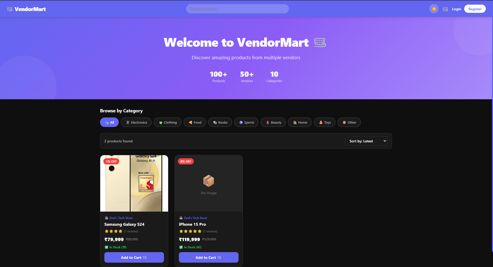
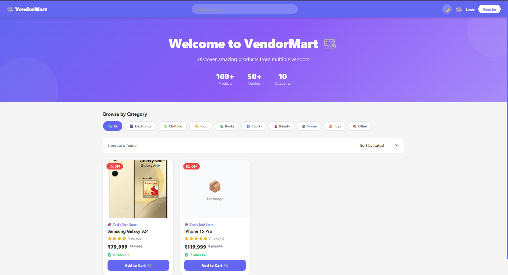
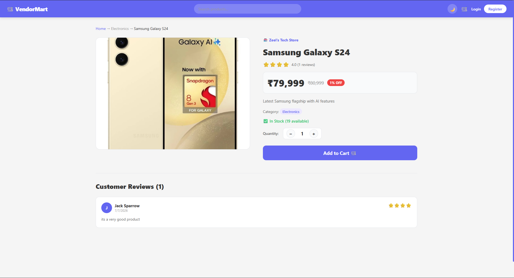
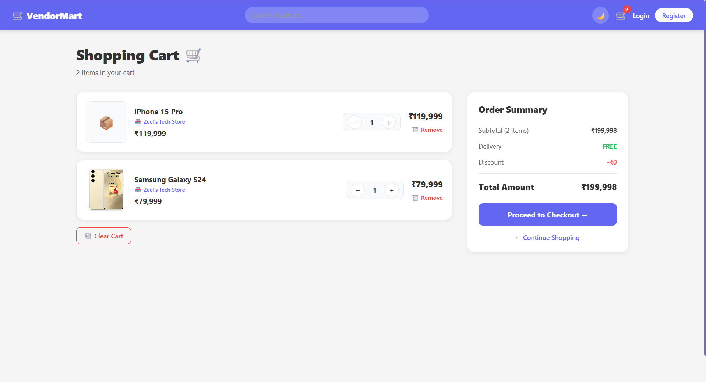
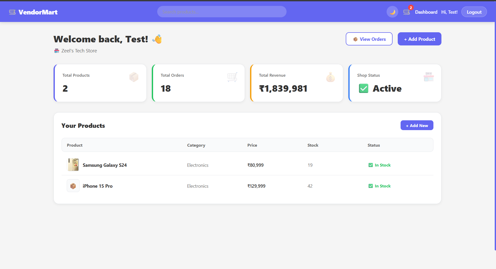
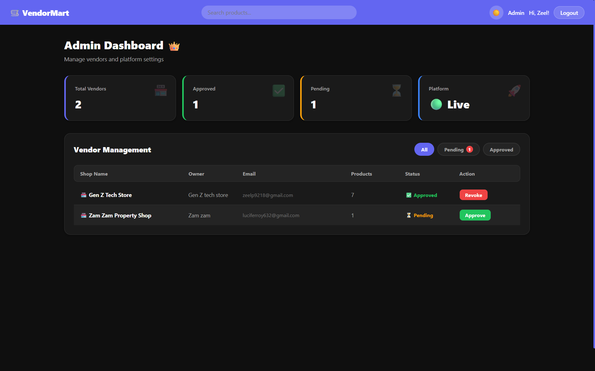

# VendorMart — Multi-Vendor E-Commerce Platform

A full-stack multi-vendor marketplace built with the MERN stack. Multiple vendors can list products, customers can shop across vendors in a single checkout, and admins manage the platform.

🔗 **Live Demo:** https://ecommerce-platform-murex.vercel.app/
🔗 **API:** https://vendormart-api.onrender.com
🔗 **GitHub:** https://github.com/zeel2384/ecommerce-platform

---

## Features

### Customer
- OTP-based email verification on registration
- Forgot password with OTP reset flow
- Browse products with search, filter by category, sort by price
- Product detail page with image gallery and reviews
- Add to cart with per-user cart persistence
- Multi-step checkout with address and mock payment
- Order tracking with real-time status updates
- Order confirmation email via Gmail OAuth2 API

### Vendor
- Shop setup and management
- Product CRUD with Cloudinary image upload
- Delete products from dashboard
- Order management with status updates
- Revenue and order analytics dashboard

### Admin
- Vendor approval system
- Platform-wide vendor management
- Real-time platform statistics

### Technical Highlights
- JWT authentication with role-based access (customer/vendor/admin)
- OTP email verification for registration and forgot password
- Dark / Light theme toggle with CSS variables
- Mobile responsive design with hamburger menu
- Per-user cart persistence in localStorage
- Gmail OAuth2 API for transactional emails
- Mock payment flow with production-ready architecture
- Role-aware routing and protected routes
- History-replace navigation after auth

---

## Tech Stack

**Frontend:**
- React + Vite
- React Router DOM
- Axios with interceptors
- React Hot Toast
- CSS Variables (Dark/Light theme)
- Custom useViewport hook for responsiveness

**Backend:**
- Node.js + Express
- MongoDB + Mongoose
- JWT Authentication + bcrypt
- Multer + Cloudinary (image uploads)
- Gmail OAuth2 API via googleapis package
- Socket.io (real-time features)

**Deployment:**
- Frontend → Vercel
- Backend → Render
- Database → MongoDB Atlas
- Images → Cloudinary

---

## Screenshots

### 🏠 Homepage — Light & Dark Mode








### 📱 Product Detail Page





### 🛒 Shopping Cart





### 🏪 Vendor Dashboard





### 👑 Admin Dashboard





---

## Getting Started

### Prerequisites
- Node.js v18+
- MongoDB Atlas account
- Cloudinary account
- Google Cloud Console account (Gmail API)

### Installation

1. Clone the repository
```bash
git clone https://github.com/zeel2384/ecommerce-platform.git
cd ecommerce-platform
```

2. Install backend dependencies
```bash
cd server
npm install
```

3. Create `.env` file in server folder
```env
PORT=5000
NODE_ENV=development
MONGO_URI=your_mongodb_uri
JWT_SECRET=your_jwt_secret
JWT_EXPIRE=7d
CLOUDINARY_CLOUD_NAME=your_cloud_name
CLOUDINARY_API_KEY=your_api_key
CLOUDINARY_API_SECRET=your_api_secret
EMAIL_ADDRESS=your_gmail
GMAIL_CLIENT_ID=your_client_id
GMAIL_CLIENT_SECRET=your_client_secret
GMAIL_REFRESH_TOKEN=your_refresh_token
CLIENT_URL=http://localhost:5173
```

4. Install frontend dependencies
```bash
cd ../client
npm install
```

5. Create `.env` file in client folder
```env
VITE_API_URL=http://localhost:5000/api
```

6. Run the project
```bash
# Terminal 1 — Backend
cd server
npm run dev

# Terminal 2 — Frontend
cd client
npm run dev
```

---

## Project Structure

```
ecommerce-platform/
├── client/                    # React frontend
│   └── src/
│       ├── api/               # Axios instance + API calls
│       ├── components/
│       │   ├── common/        # Navbar
│       │   └── product/       # ProductCard
│       ├── context/           # Auth, Cart, Theme context
│       ├── hooks/             # useViewport, useWindowSize
│       └── pages/
│           ├── auth/          # Login, Register, VerifyOTP
│           │                  # ForgotPassword, ResetPassword
│           ├── customer/      # Home, Product, Cart
│           │                  # Checkout, MyOrders
│           ├── vendor/        # Dashboard, AddProduct, Orders
│           └── admin/         # Dashboard
└── server/                    # Node.js backend
    └── src/
        ├── config/            # DB + Cloudinary config
        ├── controllers/       # Business logic
        ├── middleware/        # Auth middleware
        ├── models/            # Mongoose schemas
        ├── routes/            # API routes
        └── utils/             # OTP generator, Email sender
```

---

## API Endpoints

### Auth
- `POST /api/auth/register` — Register + send OTP
- `POST /api/auth/verify-otp` — Verify registration OTP
- `POST /api/auth/resend-otp` — Resend OTP
- `POST /api/auth/login` — Login user
- `POST /api/auth/forgot-password` — Send forgot password OTP
- `POST /api/auth/verify-forgot-otp` — Verify forgot password OTP
- `POST /api/auth/reset-password` — Reset password
- `GET /api/auth/me` — Get current user

### Products
- `GET /api/products` — Get all products (search, filter, sort, paginate)
- `GET /api/products/:id` — Get single product
- `POST /api/products` — Create product (vendor)
- `PUT /api/products/:id` — Update product (vendor)
- `DELETE /api/products/:id` — Delete product (vendor)
- `POST /api/products/:id/reviews` — Add review (customer)

### Orders
- `POST /api/orders` — Create order (customer)
- `GET /api/orders/my-orders` — Get customer orders
- `GET /api/orders/vendor-orders` — Get vendor orders
- `PUT /api/orders/:id/status` — Update order status (vendor)

### Vendor
- `POST /api/vendor/setup` — Setup vendor shop
- `GET /api/vendor/profile` — Get vendor profile
- `PUT /api/vendor/profile` — Update vendor profile
- `GET /api/vendor/all` — Get all vendors (admin)
- `PUT /api/vendor/:id/approve` — Approve vendor (admin)

---

## Key Engineering Decisions

### Why Mock Payment?
Real payment gateways require KYC verification and business registration. Mock payment demonstrates the complete checkout architecture — order creation, stock management, email confirmation — without the KYC barrier. The architecture is designed to swap in a real gateway by replacing the payment service.

### Why Gmail OAuth2 instead of SMTP?
Render's free tier blocks outgoing SMTP ports (465, 587). Gmail OAuth2 uses HTTPS port 443 which is never blocked, making it the most reliable solution for transactional emails on free hosting.

### Why per-user cart in localStorage?
Cart data is stored under `cart_${userId}` key so multiple users on the same device each have their own cart. Cart persists across page refreshes but clears on logout, preventing data leakage between users.

### Why CSS Variables for theming?
CSS variables allow instant theme switching without re-rendering React components. All colors are defined as variables in `:root` (light) and `body.dark` (dark), making the theme system maintainable and performant.

---

## Author

**Zeel Patel**
- GitHub: [@zeel2384](https://github.com/zeel2384)
- LinkedIn: https://www.linkedin.com/in/zeel0807/

---

## License

MIT License